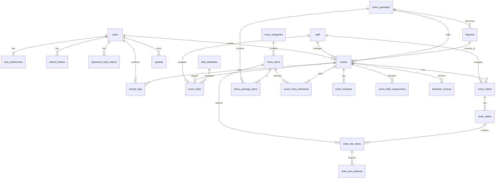

# Database Relationships — Just Tap Super Admin Mobile

> Scope: Figma Frame 1261155661 only. 25 tables + 7 views. No web console tables.

## Entity Relationship Overview



## Tables (25)

### Authentication (5)

| Table | Purpose | Soft Delete | UUID |
|-------|---------|-------------|------|
| `users` | Super Admin accounts | Yes | Yes |
| `refresh_tokens` | JWT refresh rotation | No | No |
| `password_reset_tokens` | Password reset flow | No | No |
| `otp_verifications` | OTP login | No | No |
| `user_preferences` | Settings toggles | No | No |

### Operations (3)

| Table | Purpose | Soft Delete | UUID |
|-------|---------|-------------|------|
| `staff` | Event managers / waiters | Yes | Yes |
| `inquiries` | Pre-event leads | Yes | Yes |
| `events` | Catering events | Yes | Yes |

### Event detail (2)

| Table | Purpose | Soft Delete | UUID |
|-------|---------|-------------|------|
| `event_functions` | Sub-functions per event | Yes | Yes |
| `event_menu_selections` | Menu planning selections | Yes | No |

### Menu catalog (4)

| Table | Purpose | Soft Delete | UUID |
|-------|---------|-------------|------|
| `menu_categories` | Category list screen | Yes | Yes |
| `menu_items` | Item list screen | Yes | Yes |
| `menu_packages` | Package dropdown | Yes | Yes |
| `menu_package_items` | Package ↔ item junction | No | No |

### On-ground ops (4)

| Table | Purpose | Soft Delete | UUID |
|-------|---------|-------------|------|
| `event_table_assignments` | Table / captain allocation | Yes | Yes |
| `task_templates` | Reusable task definitions | Yes | Yes |
| `event_tasks` | Tasks per event | Yes | Yes |
| `event_orders` | Live order session | Yes | Yes |

### Orders (3)

| Table | Purpose | Soft Delete | UUID |
|-------|---------|-------------|------|
| `order_tables` | Per-table overview | Yes | Yes |
| `order_line_items` | Line items per table | Yes | Yes |
| `order_item_batches` | Delivery batch history | Yes | Yes |

### Support (4)

| Table | Purpose | Soft Delete | UUID |
|-------|---------|-------------|------|
| `feedback_reviews` | Event feedback | Yes | Yes |
| `content_pages` | About / Contact CMS | No | No |
| `uploads` | File metadata | Yes | Yes |
| `activity_logs` | Audit trail | No | No |

## Foreign Keys

| Child | Column | Parent | On Delete |
|-------|--------|--------|-----------|
| refresh_tokens | user_id | users.id | CASCADE |
| password_reset_tokens | user_id | users.id | CASCADE |
| user_preferences | user_id | users.id | CASCADE |
| menu_items | category_id | menu_categories.id | RESTRICT |
| menu_package_items | package_id | menu_packages.id | CASCADE |
| menu_package_items | menu_item_id | menu_items.id | CASCADE |
| inquiries | package_id | menu_packages.id | SET NULL |
| inquiries | converted_event_id | events.id | SET NULL |
| events | inquiry_id | inquiries.id | SET NULL |
| events | package_id | menu_packages.id | SET NULL |
| events | assigned_manager_id | staff.id | SET NULL |
| events | created_by | users.id | SET NULL |
| event_functions | event_id | events.id | CASCADE |
| event_menu_selections | event_id | events.id | CASCADE |
| event_menu_selections | menu_item_id | menu_items.id | CASCADE |
| event_table_assignments | event_id | events.id | CASCADE |
| event_tasks | event_id | events.id | CASCADE |
| event_tasks | task_template_id | task_templates.id | SET NULL |
| event_tasks | assigned_to | staff.id | SET NULL |
| event_orders | event_id | events.id | CASCADE |
| event_orders | manager_id | staff.id | SET NULL |
| order_tables | event_order_id | event_orders.id | CASCADE |
| order_line_items | order_table_id | order_tables.id | CASCADE |
| order_line_items | menu_item_id | menu_items.id | SET NULL |
| order_item_batches | order_line_item_id | order_line_items.id | CASCADE |
| feedback_reviews | event_id | events.id | CASCADE |
| uploads | user_id | users.id | SET NULL |
| activity_logs | event_id | events.id | SET NULL |
| activity_logs | user_id | users.id | SET NULL |

## Views (7)

| View | Used by |
|------|---------|
| `v_events_list` | Home / Events tab list API |
| `v_events_calendar` | Calendar markers API |
| `v_inquiries_pending` | Inquiry tab |
| `v_task_summary` | Tasks KPI cards |
| `v_feedback_summary` | Feedback rating header |
| `v_menu_categories_with_counts` | Menu Category screen |
| `v_event_orders_overview` | Order overview screen |

## Triggers (5)

| Trigger | Purpose |
|---------|---------|
| `trg_users_before_soft_delete` | Anonymize email/phone on soft delete |
| `trg_order_line_items_after_insert` | Sync `event_orders` totals |
| `trg_order_line_items_after_update` | Sync `event_orders` totals |
| `trg_order_line_items_after_delete` | Sync `event_orders` totals |
| `trg_event_tasks_before_update` | Auto-mark overdue tasks |

## Check Constraints

- `users.role` = `super_admin`
- `events.end_date` >= `start_date`
- `menu_items.price` >= 0
- `event_functions.pax` > 0 (when set)
- `feedback_reviews.rating` between 1.0 and 5.0
- `order_line_items.quantity` > 0
- `event_orders.delivered_count` <= `total_items`

## Commands

```bash
npm run db:migrate   # Run migrations only
npm run db:seed      # Run seeders only
npm run db:setup     # Migrate + seed (fresh DB)
```

Full consolidated SQL: [`schema.sql`](schema.sql)
